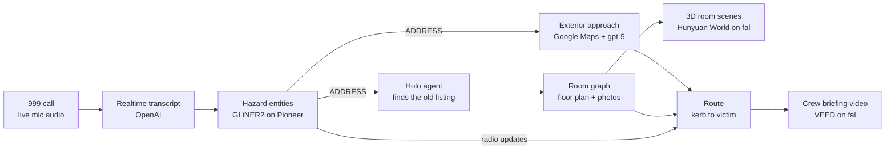

# Lantern

**Know the building before you go through the door.**


When firefighters arrive at a house fire, they know nothing. No floor plan.
No idea where the fire started or which room someone is trapped in. They find
out by crawling through black smoke, one second at a time.

Last year **271 people died in fires in England**. Nearly eight in ten died
at home. Crews take about **eight minutes** to arrive — eight minutes of
driving, then zero seconds of knowing. We fixed the second part.

## Why we built this

The inside of that house is already on the internet. Photos, floor plan —
sitting in the old property listing from the day it was sold. And the 999
call already says where the fire is and where the person is. Nobody has
ever connected the two.

Lantern does. While the caller is still on the line, the dispatch console
fills with the building: the front door they will go through, the floor
plan, the room the victim was reported in, a 3D reconstruction of it, and
a route from the kerb. "Size-up" is the fire service term for the rapid
assessment an incident commander makes on arrival. We moved it to before
the truck leaves.

We are not selling AI-generated floor plans. We are selling
**information → time**.

```
TODAY                              LANTERN

999 call                           999 call
"Dad is upstairs,                  "Dad is upstairs,
 back bedroom..."                   back bedroom..."
        │                                   │
   speech only                    Pioneer extracts
        │                          victim = rear
        ▼                          upstairs bedroom
firefighters arrive                         │
        │                          H finds the listing
enter an unfamiliar                         │
building                            spatial briefing:
        │                           victim · fire ·
search room by room                 route · hazards
        │                                   │
   find the victim                  targeted search
```

Every second of orientation we save is a second closer to the person
inside.

### What the evidence actually says

This is not "AI helps firefighters navigate." The premise is narrower and
stronger: **spatial intelligence can cut interior search time substantially,
and fire-rescue survival is time-sensitive.**

In a 2025 *Fire* experiment, crews in an unfamiliar, smoke-obscured
environment were given the trapped person's location on a floor plan — or
not. Average time to the victim fell from **4m 18s to 2m 50s**: **87
seconds, 34% faster**. Five of the 41 teams searching without a location
never found the victim and abandoned the search.

```
WITHOUT LOCATION INTELLIGENCE     4m 18s
█████████████████████████████████

WITH VICTIM LOCATION              2m 50s
██████████████████████

                         −87 seconds   −33.7%
                         Kuo & Lin, Fire, 2025
```

That is not a few seconds. Searching a single 12 m² bedroom already takes
on the order of **four minutes** in experimental interior-search
conditions. Without a location, crews pay that cost for every wrong room.
With one, they skip the rooms that do not matter.

Those tens of seconds sit inside an environment that deteriorates in
minutes. Full-scale experiments on modern furnished rooms have measured
flashover in roughly **3–5 minutes**, and untenable living-room conditions
in a little over three. This is not a setting where 90 seconds is a
rounding error.

Shorter fire-service **response** times are also associated with more
rescues. That evidence is about arrival, not search after arrival, so we
do not claim "Lantern saves X% of lives per minute." The defensible
statement is the one the papers support: knowing where the victim was
reported can cut search time by about a third, and the clock that search
is racing is measured in minutes.

Route and layout information help in the same direction. First responders
given a head-mounted floor-plan display navigated **38% faster**, travelled
**44% less distance**, and made **60% fewer errors**. Firefighter
wayfinding studies found that **explicit route information** beat being
handed a complicated plan and asked to invent a path. So the briefing is
not a raw floor plan with two pins. It is a route:

```
VICTIM     first floor → rear bedroom
ENTRY      front door
ROUTE      entrance → hallway → stairs → rear-right bedroom
HAZARD     kitchen fire
AVOID      smoke reported on the main staircase
```

### Decision support, not gospel

A listing may be years stale. Reconstructed geometry can be wrong.
Lantern is a pre-arrival briefing, not an autonomous navigation system.
Every fact on the brief carries a source, and the interface is honest
about the gap.

| Weight | What it is | Example |
|---|---|---|
| **Confirmed** | Spoken on the call | Victim reported upstairs, rear bedroom. Kitchen fire. Occupant cannot walk. |
| **Source-derived** | Read from the listing or the street | Two bedrooms upstairs. Kitchen appears ground-floor rear. Front door on the left. |
| **Inferred** | Modelled, labelled as such | Approximate room geometry. Likely connecting hallway. |

The crew treats it as prior knowledge, not ground truth. By the time the
caller hangs up, they have already walked through the house — as a
briefing, not as a promise.

The UK figures above are from official statistics for the year ending
March 2025: 271 fire-related fatalities, of which 208 (77%) were in
dwellings; average first-appliance response to dwelling fires with
victims or rescues was 7 minutes 58 seconds ([MHCLG / GOV.UK](https://www.gov.uk/government/statistics/detailed-analysis-of-fires-england-april-2024-to-march-2025/detailed-analysis-of-fires-and-response-times-to-fires-attended-by-fire-and-rescue-services-england-april-2024-to-march-2025),
FIRE0502, FIRE1002). Search-time result: Kuo & Lin, *Fire* 8(3):114,
2025. Bedroom search order-of-magnitude: *Fire Safety Journal*, 2021.
Flashover / untenability: FSRI modern-furnishings experiments; NIST
living-room tests. Response time and survival: Jaldell, *Fire
Technology*; Runefors et al. (Swedish residential-fire data). Navigation
assistance and route/survey wayfinding: first-responder HMD study;
*Safety Science* firefighter experiments, 2021 and 2023.

## How it works



The moment the caller says the address, two chains fire in parallel:

- **Outside in.** Google Maps geocodes it, pulls Street View at computed
  headings plus a satellite tile, and gpt-5 reads them into an approach:
  building type, storeys, which side the front door is on, rear access,
  where the appliance can park.
- **Inside out.** A computer-use agent (Holo 3.1 driving a real Chromium via
  Playwright) searches Rightmove sold prices, finds the house, opens the
  listing and extracts the photo gallery and floor plan. Its screenshots
  stream to the console as a live agent cam.

The floor plan becomes a room graph with photos matched to rooms. fal's
Hunyuan World turns the critical rooms into explorable 3D scenes with hazards
pinned. A route is planned from the kerb to the victim, and a 30 second crew
briefing is generated. Radio updates typed mid-incident re-extract, move the
pins and replan the route.

## The screens

| Route | What it is |
|---|---|
| `/` | Address entry |
| `/phone` | The caller's handset: Call 999, mic streaming, cue cards |
| `/console` | The dispatch console: transcript, hazard board, agent cam, floor plan, scenes |
| `/video` | The crew brief: briefing video with attachments on top |

Press `R` anywhere to replay a recorded call through the identical pipeline.

## Partner technology

| Tech | Role |
|---|---|
| **OpenAI** | Realtime transcription, vision reads (approach, floor plan, photo matching), route planning, synthetic training data |
| **fal** | Hunyuan World image-to-world reconstruction of rooms, VEED briefing video |
| **H Company** | Holo 3.1 as the brain of the listing-finding agent, one screenshot to one action |
| **Pioneer (Fastino)** | GLiNER2 fine-tuned on synthetic 999 transcripts, millisecond CPU extraction on streaming chatter |

Google Maps (Geocoding, Street View Static, Maps Static) powers the exterior
approach. It is not a partner technology, it is in because a size-up starts at
the kerb.

## Repo layout

```
frontend/              Next.js app: the four screens above
backend/building/      Address to building: approach, agent, room graph, reconstruction
backend/intelligence/  Transcript to decisions: extraction, route, briefing
backend/shared/        Locked types and the event bus every lane speaks
worker/                Cloudflare Worker rendering the walkthrough on fal
```

## Run it

Backend (Python 3.12+, [uv](https://docs.astral.sh/uv/)):

```bash
cd backend
cp .env.example .env        # fill in the keys, comments say where each comes from
uv sync
uv run playwright install chromium
uv run python -m scripts.smoke_approach "22 Kellett Road, London SW2 1EB"
uv run python -m scripts.smoke_agent    "22 Kellett Road, London SW2 1EB"
uv run python -m scripts.smoke_rooms    "22 Kellett Road, London SW2 1EB"
uv run python -m scripts.smoke_reconstruct
```

Frontend:

```bash
cd frontend && npm install && npm run dev    # http://localhost:3000
```

Worker: see `worker/README.md`. Lane details: `backend/intelligence/README.md`
and `frontend/README.md`.

Every stage degrades to cached results for the properties in
`docs/test-properties.md`, so the pipeline demos end to end even with no keys.

## Team

Built in one day at the {Tech: Europe} x VEED Summer Lock-In, London, by
Mykyta, Oriol and Bill.

## Docs

Everything written down lives in [`docs/`](docs/), except the two files tooling
resolves at the repo root (`PRODUCT.md`, `DESIGN.md`).

| Document | What it is |
|---|---|
| [`docs/lantern-final-prd.md`](docs/lantern-final-prd.md) | The master PRD. Locked. |
| [`docs/prd-mykyta-call-and-ui.md`](docs/prd-mykyta-call-and-ui.md) | Call system and UI lane |
| [`docs/prd-oriol-agent-and-building.md`](docs/prd-oriol-agent-and-building.md) | Agent and building lane |
| [`docs/prd-bill-intelligence-and-media.md`](docs/prd-bill-intelligence-and-media.md) | Intelligence and media lane |
| [`docs/INTEGRATION.md`](docs/INTEGRATION.md) | How the pieces are actually wired, and the commands to drive them |
| [`docs/frontend-integration.md`](docs/frontend-integration.md) | The handoff note written *before* the lanes were joined |
| [`frontend/README.md`](frontend/README.md) | Frontend → backend: routes, the bus swap point, placeholder replace list |
| [`docs/test-properties.md`](docs/test-properties.md) | Vetted golden properties for the demo |
| [`docs/bill_worklog.md`](docs/bill_worklog.md) | Bill's lane work log |
| [`docs/BILL-RENAME-NOTES.md`](docs/BILL-RENAME-NOTES.md) | What the SizeUp → Lantern rename deliberately left alone |
| [`PRODUCT.md`](PRODUCT.md) · [`DESIGN.md`](DESIGN.md) | Product truth and the visual system |
