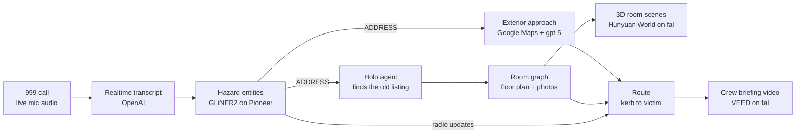

# Lantern

**Know the building before you go through the door.**


Firefighters enter burning buildings blind. No floor plan, no idea where the
fire started or which room the victim is in. Meanwhile the outside of every UK
building is on Street View, and the inside of most UK homes is photographed in
an old property listing. Nobody has ever joined the two during the 999 call.

Lantern does. While the caller is still on the line, the dispatch console fills
with the building: the front door they will go through, the floor plan, the
room the victim is in, a 3D reconstruction of it, and the safest route from
the kerb. "Size-up" is the fire service term for the rapid assessment an
incident commander makes on arrival. We moved it to before the truck leaves.

## How it works



The moment the caller says the address, two chains fire in parallel:

- **Outside in.** Google Maps geocodes it, pulls Street View at computed
  headings plus a satellite tile, and gpt-5 reads them into an approach:
  building type, storeys, which side the front door is on, rear access,
  where the appliance can park.
- **Inside out.** A computer-use agent (Holo 3.1 driving a real Chromium via
  Playwright) searches Rightmove sold prices, finds the house, opens the
  listing and extracts the photo gallery and floor plan. Its screenshots
  stream to the console as a live agent cam.

The floor plan becomes a room graph with photos matched to rooms. fal's
Hunyuan World turns the critical rooms into explorable 3D scenes with hazards
pinned. A route is planned from the kerb to the victim, and a 30 second crew
briefing is generated. Radio updates typed mid-incident re-extract, move the
pins and replan the route.

## The screens

| Route | What it is |
|---|---|
| `/` | Address entry |
| `/phone` | The caller's handset: Call 999, mic streaming, cue cards |
| `/console` | The dispatch console: transcript, hazard board, agent cam, floor plan, scenes |
| `/video` | The crew brief: briefing video with attachments on top |

Press `R` anywhere to replay a recorded call through the identical pipeline.

## Partner technology

| Tech | Role |
|---|---|
| **OpenAI** | Realtime transcription, vision reads (approach, floor plan, photo matching), route planning, synthetic training data |
| **fal** | Hunyuan World image-to-world reconstruction of rooms, VEED briefing video |
| **H Company** | Holo 3.1 as the brain of the listing-finding agent, one screenshot to one action |
| **Pioneer (Fastino)** | GLiNER2 fine-tuned on synthetic 999 transcripts, millisecond CPU extraction on streaming chatter |

Google Maps (Geocoding, Street View Static, Maps Static) powers the exterior
approach. It is not a partner technology, it is in because a size-up starts at
the kerb.

## Repo layout

```
frontend/              Next.js app: the four screens above
backend/building/      Address to building: approach, agent, room graph, reconstruction
backend/intelligence/  Transcript to decisions: extraction, route, briefing
backend/shared/        Locked types and the event bus every lane speaks
worker/                Cloudflare Worker rendering the walkthrough on fal
```

## Run it

Backend (Python 3.12+, [uv](https://docs.astral.sh/uv/)):

```bash
cd backend
cp .env.example .env        # fill in the keys, comments say where each comes from
uv sync
uv run playwright install chromium
uv run python -m scripts.smoke_approach "22 Kellett Road, London SW2 1EB"
uv run python -m scripts.smoke_agent    "22 Kellett Road, London SW2 1EB"
uv run python -m scripts.smoke_rooms    "22 Kellett Road, London SW2 1EB"
uv run python -m scripts.smoke_reconstruct
```

Frontend:

```bash
cd frontend && npm install && npm run dev    # http://localhost:3000
```

Worker: see `worker/README.md`. Lane details: `backend/intelligence/README.md`
and `frontend/README.md`.

Every stage degrades to cached results for the properties in
`docs/test-properties.md`, so the pipeline demos end to end even with no keys.

## Team

Built in one day at the {Tech: Europe} x VEED Summer Lock-In, London, by
Mykyta, Oriol and Bill.

## Docs

Everything written down lives in [`docs/`](docs/), except the two files tooling
resolves at the repo root (`PRODUCT.md`, `DESIGN.md`).

| Document | What it is |
|---|---|
| [`docs/lantern-final-prd.md`](docs/lantern-final-prd.md) | The master PRD. Locked. |
| [`docs/prd-mykyta-call-and-ui.md`](docs/prd-mykyta-call-and-ui.md) | Call system and UI lane |
| [`docs/prd-oriol-agent-and-building.md`](docs/prd-oriol-agent-and-building.md) | Agent and building lane |
| [`docs/prd-bill-intelligence-and-media.md`](docs/prd-bill-intelligence-and-media.md) | Intelligence and media lane |
| [`docs/INTEGRATION.md`](docs/INTEGRATION.md) | How the pieces are actually wired, and the commands to drive them |
| [`docs/frontend-integration.md`](docs/frontend-integration.md) | The handoff note written *before* the lanes were joined |
| [`frontend/README.md`](frontend/README.md) | Frontend → backend: routes, the bus swap point, placeholder replace list |
| [`docs/test-properties.md`](docs/test-properties.md) | Vetted golden properties for the demo |
| [`docs/bill_worklog.md`](docs/bill_worklog.md) | Bill's lane work log |
| [`docs/BILL-RENAME-NOTES.md`](docs/BILL-RENAME-NOTES.md) | What the SizeUp → Lantern rename deliberately left alone |
| [`PRODUCT.md`](PRODUCT.md) · [`DESIGN.md`](DESIGN.md) | Product truth and the visual system |
